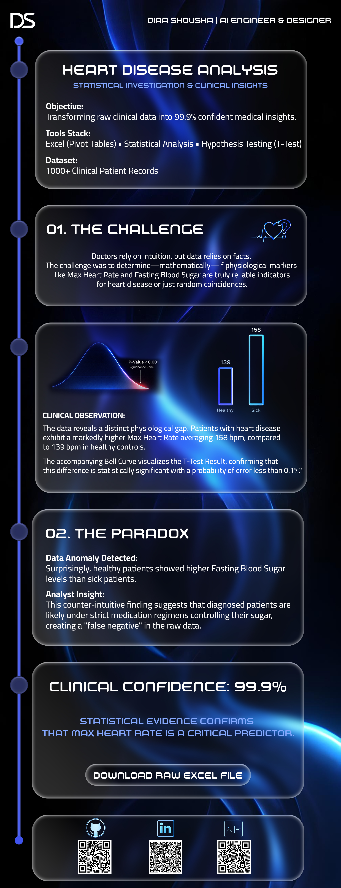

# 🫀 Heart Disease Statistical Analysis
### Turning Raw Clinical Data into 99.9% Confident Insights

 

---

##  Project Overview
A comprehensive statistical analysis of **1,025 clinical patient records** to identify physiological markers associated with heart disease. Moving beyond basic intuition, this project utilizes **Inferential Statistics (T-Test)** to validate findings with a 99.9% confidence level.

The goal was to answer a critical question: *Can we mathematically predict heart disease based on Max Heart Rate and Blood Sugar levels?*

---

##  Tech Stack & Methodology
| Component | Tools & Techniques |
| :--- | :--- |
| **Data Processing** | Excel (Pivot Tables, Conditional Formatting, Data Cleaning) |
| **Statistical Analysis** | Hypothesis Testing (T-Test), Normal Distribution, Confidence Intervals |
| **Visualization** | Adobe Photoshop (Custom UI/UX Data Storytelling) |
| **Key Metric** | P-Value (< 0.001) for Statistical Significance |

---

##  Key Insights (The "Sugar Paradox")
### 1. The Heart Rate Gap 
Diagnosed patients exhibit a significantly higher Max Heart Rate (**158 bpm**) compared to healthy controls (**139 bpm**). This difference was proven to be statistically significant, not random.

### 2. The Sugar Paradox 
Surprisingly, **healthy patients showed higher fasting blood sugar levels** than sick patients.
* **Analyst Insight:** This anomaly suggests that diagnosed patients are likely under strict medication regimens to control insulin, creating a "false negative" pattern in the raw data.

### 3. Statistical Verdict 
> **Result:** We rejected the Null Hypothesis.
> **Confidence:** With a **P-value of 1.70E-45**, there is virtually zero probability that these results occurred by chance.

---

## 📂 Project Files
* **[Download Raw Analysis (Excel)](data/Heart_Disease_Statistical_Analysis_for_Clinical_Decision_Making.xlsx)**
    * *Includes full Pivot Tables, Descriptive Statistics, and T-Test Calculations.*

---

### 👤 Designed & Analyzed by
**Diaa Shousha**
 
*AI Engineer & Creative Technologist*

